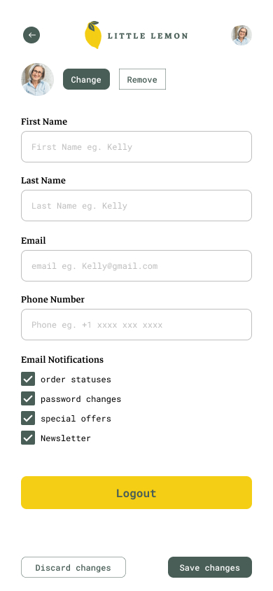

# Capstone project.
The following is the screenshot for both mockups and high fidelity design

### Mockups
Low fidelity design

### High fidelity design

### Errors 

Invariant Violation: Module AppRegistry is not a registered callable module (calling runApplication). A frequent cause of the error is that the application entry file path is incorrect. This can also happen when the JS bundle is corrupt or there is an early initialization error when loading React Native.

Fix:
<code>npm start --reset-cache</code>
